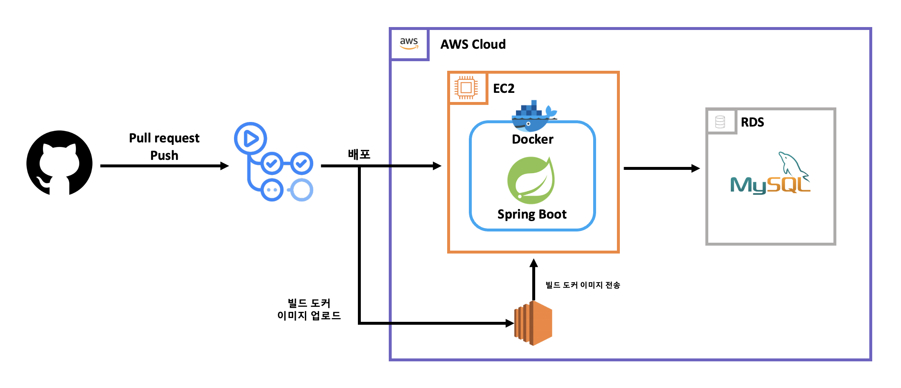

# CI/CD 프로젝트

## 1. 프로젝트 소개
| 2025.08 의성 청년 개발자 프로젝트에서 진행되었던 프로젝트에 적용되었던 CI/CD 부분의 요소만 가져온 프로젝트 입니다.
Handscope 프로젝트는 노인 비율이 높은 의성에서 노인 층의 뇌진환을 사전에 예방하는 프로젝트로 
특정 손 동작을 매핑하여 뇌 질환 위험 성을 측정하여 예방하는 프로젝트 입니다.

## 2. 팀원 구성
| 이성윤 | 이성민 | 신국현    | 박준희 | 최권진 |
|-----|-----|--------|-----|-----
| PM  | PM  | Devops | BE  | FE  |

### 이성윤, 이성민
- 프로젝트 선정, 논문 및 정보 검증

### 신국현
- 인프라 및 CI/CD 구축
- DB 설계

### 박준희
- 로그인 
- GPT API

### 최권진
- 손 매핑
- 렌더링 페이지

## 3. 문서
#### [Handscope_기획서](./doc/핸드스코드_기획서.pdf)
#### [Handscope_PPT](./doc/핸드스코드_발표.pdf)
#### [Handscope_설문](https://form.naver.com/response/LWxRq8-sKbRRFq8SF-YfXw)

## 4.개발 구조
### CI/CD

## 개발 기간 및 작업 관리
- 프로젝트 기간 : 2025.08.18 ~ 2025.08.29
- 분석 설계 : 2025.08.18 ~ 2025.08.21
- 개발 기간 : 2025.08.21 ~ 2025.08.27
- 홍보 기간 : 2025.08.24 ~ 2025.08.27
- 발 표 : 2025.08.28 

| 8월    |18| 19 |20|21|22|23|24|25|26| 27 |28|29|
|-------|-|----|-|-|-|-|-|-|-|----|-|-|
| 분석 설계 | ✅| ✅  |✅|✅|
| 개발 기간 ||    ||✅|✅|✅|✅|✅|✅| ✅  |
| 홍보 기간 |||||||✅|✅|✅| ✅  |
| 발 표 ||||||||||    |✅|

# 결과
### [Handscope](https://www.handscope.kr/)

