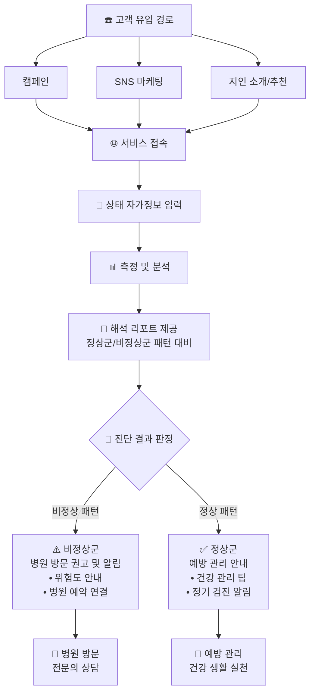

# CI/CD 프로젝트

## 1. 프로젝트 소개
> 2025.08 의성 청년 개발자 프로젝트에서 진행되었던 프로젝트에 적용되었던 CI/CD 부분의 요소만 가져온 프로젝트 입니다.

Handscope 프로젝트는 노인 비율이 높은 의성에서 노인 층의 뇌진환을 사전에 예방하는 프로젝트로 
특정 손 동작을 매핑하여 뇌 질환 위험 성을 측정하여 예방하는 프로젝트 입니다.

### 개요
시장에서 자주 마주치던 어르신 한 분이 계셨습니다. 언제나 정정하게 장을 보시던 모습이 아직도 눈에 선합니다.
그런데 언젠가부터 그분의 손이 미세하게 떨리는 것을 보게되었는데 물건 값을 치르실 때, 찻잔을 드실 때처럼 아주 사소한 순간들이었죠.

저를 포함한 모두가 그저 '나이가 들어 그러시겠지' 하고 무심코 지나쳤지만 그것은 단순한 노화가 아닌, 뇌 질환이 보내는 첫 번째 '신호'였고 안타깝게도 저희가 그 신호의 의미를 알게 되었을 때는, 이미 너무 늦은 뒤였습니다.

안타까운 소식을 접하며 계속 되뇌었습니다.
'어떻게 하면 저 작은 신호를 조금이라도 더 빨리 알아챌 수 있었을까?'

저희는 이 중요한 문제를 더 이상 '무심함'이나 막연한 '직감'에만 맡겨둘 수 없다고 결심했습니다.

뇌 질환은 치료의 골든타임이 생명과도 같지만, 우리 사회는 너무나 쉽게 '나이 탓'이라며 그 소중한 시간을 놓쳐버립니다. 그래서 저희는 막연한 '감'이 아닌, 명확한 '데이터'로 그 골든타임을 지킬 방법을 찾아야만 했습니다.

이 절실한 고민의 결과가, 바로 오늘 저희가 여러분께 보여드릴 솔루션입니다.

### 한줄 목표
고령자 대상 손동작 기반 뇌질환 사전 위험 알림 서비스 개발

## 2. 팀원 구성
| 이성윤 | 이성민 | 신국현    | 박준희 | 최권진 |
|-----|-----|--------|-----|-----
| PM  | PM  | Devops | BE  | FE  |

### 이성윤, 이성민
- 프로젝트 선정, 논문 및 정보 검증

### 신국현
- 인프라 및 CI/CD 구축
- DB 설계

### 박준희
- 로그인 
- GPT API

### 최권진
- 손 매핑
- 렌더링 페이지

## 3. Document
### 3.1 [Handscope_기획서](./doc/핸드스코프_기획서.pdf)
### 3.2 [Handscope_PPT](./doc/핸드스코프_발표.pdf)
### 3.3 [Handscope_설문](https://form.naver.com/response/LWxRq8-sKbRRFq8SF-YfXw)
### 3.4 서비스 플로우

## 4.개발 구조
### CI/CD

## 개발 기간 및 작업 관리
- 프로젝트 기간 : 2025.08.18 ~ 2025.08.29
- 분석 설계 : 2025.08.18 ~ 2025.08.21
- 개발 기간 : 2025.08.21 ~ 2025.08.27
- 홍보 기간 : 2025.08.24 ~ 2025.08.27
- 발 표 : 2025.08.28 

| 8월    |18| 19 |20|21|22|23|24|25|26| 27 |28|29|
|-------|-|----|-|-|-|-|-|-|-|----|-|-|
| 분석 설계 | ✅| ✅  |✅|✅|
| 개발 기간 ||    ||✅|✅|✅|✅|✅|✅| ✅  |
| 홍보 기간 |||||||✅|✅|✅| ✅  |
| 발 표 ||||||||||    |✅|

# 결과
### [Handscope](https://www.handscope.kr/)

